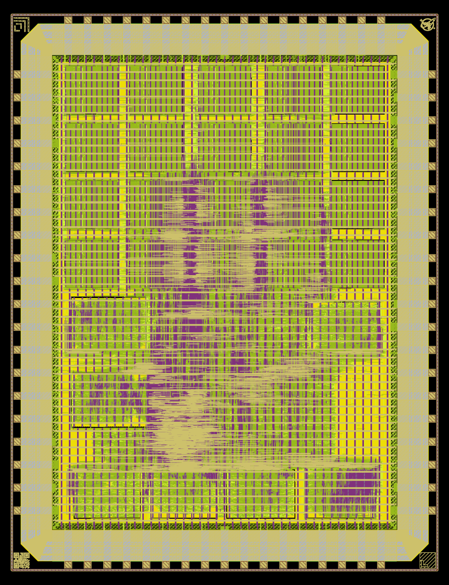
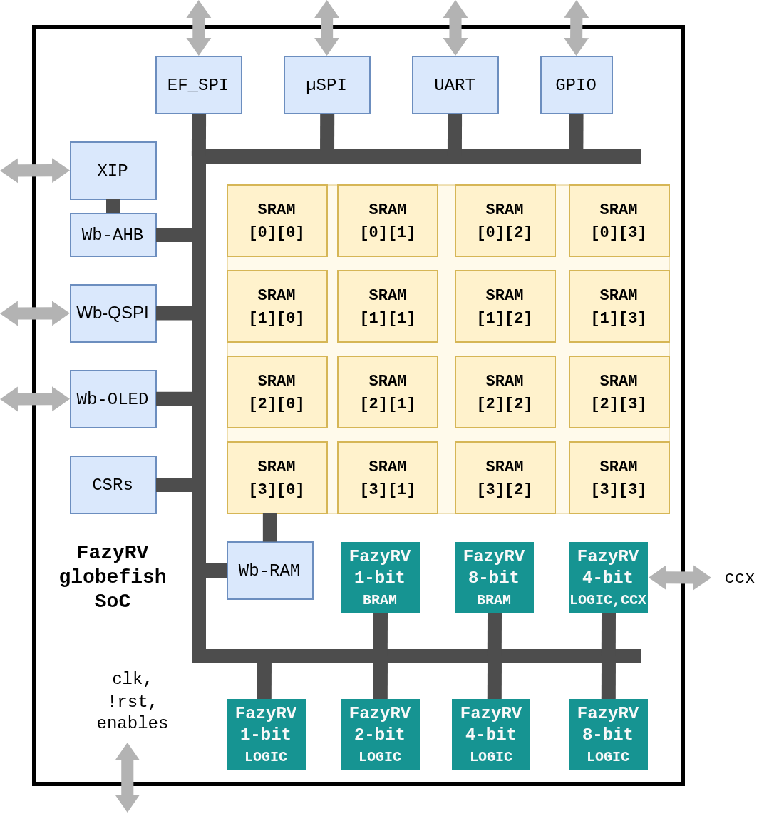

# gf180mcu FazyRV Hachure SoC

FazyRV _Hachure_ is a System on Chip that integrates seven different variants of the bit-serial FazyRV RISC-V core in one chip for testing and research purposes. The instances include 1-, 2-, 4-, and 8-bit FazyRV variants as well as a 4-bit FazyRV-CCX variant with a custom instruction interface. All instances can be clock-gated and operated individually or concurrently. They are arbitrated and share a system Wishbone bus.

<table>
<tr>
<td>

</td>
<td>

</td>
</tr>
</table>


## Boot Addresses

The boot addresses are offset to allow each core to execute its own firmware.


| Core                     | Instance    | Boot Addr |
| ------------------------ | ----------- | --------- |
| FazyRV 1-bit (LOGIC)     | i_frv_1     | 0x10      |
| FazyRV 2-bit (LOGIC)     | i_frv_2     | 0x20      |
| FazyRV 4-bit (LOGIC)     | i_frv_4     | 0x30      |
| FazyRV 8-bit (LOGIC)     | i_frv_8     | 0x40      |
| FazyRV 4-bit CCX (LOGIC) | i_frv_4ccx  | 0x60      |
| FazyRV 1-bit (BRAM)      | i_frv_1bram | 0x70      |
| FazyRV 8-bit (BRAM)      | i_frv_8bram | 0x80      |

**Note:** `0x50` is left out intentionally.


## Pin Map

Pin map of the top-level chip.

| Pad           | Pin               | Package | Dir | Description                                                  |
| ------------- | ----------------- | ------- | --- | ------------------------------------------------------------ |
| clk_pad       | clk_i             | S[0]    | in  | System clock                                                 |
| rst_n_pad     | rst_in            | S[1]    | in  | System reset (low active)                                    |
| bidir_PAD[0]  | spi_oled_sck      | S[2]    | out | SPI OLED clock                                               |
| bidir_PAD[1]  | spi_oled_sdo      | S[3]    | out | SPI OLED data                                                |
| input_PAD[0]  | en_wb             | S[4]    | in  | Enable Wishbon bus                                           |
| input_PAD[1]  | en_p              | S[5]    | in  | Enable peripherals                                           |
| input_PAD[2]  | en_p2             | S[6]    | in  | Enable redundant peripherals                                 |
| input_PAD[3]  | en_frv1           | S[7]    | in  | Enable 1-bit FazyRV core                                     |
| input_PAD[4]  | en_frv2           | S[9]    | in  | Enable 2-bit FazyRV core                                     |
| input_PAD[5]  | en_frv4           | S[10]   | in  | Enable 4-bit FazyRV core                                     |
| input_PAD[6]  | en_frv8           | S[11]   | in  | Enable 8-bit FazyRV core                                     |
| input_PAD[7]  | en_frv4ccx        | S[12]   | in  | Enable 4-bit FazyRV CCX core                                 |
| bidir_PAD[2]  | ccx4_sel[0]       | S[13]   | out | CCX cinsn select                                             |
| bidir_PAD[3]  | ccx4_sel[1]       | S[14]   | out | CCX cinsn select                                             |
| bidir_PAD[4]  | ccx4_req          | S[15]   | out | CCX request                                                  |
| input_PAD[8]  | ccx4_resp         | S[16]   | in  | CCX handshaking                                              |
| bidir_PAD[5]  | ccx4_rs_a[0]      | E[2]    | out | CCX operand a chunk                                          |
| bidir_PAD[6]  | ccx4_rs_a[1]      | E[3]    | out | CCX operand a chunk                                          |
| bidir_PAD[7]  | ccx4_rs_a[2]      | E[4]    | out | CCX operand a chunk                                          |
| bidir_PAD[8]  | ccx4_rs_a[3]      | E[5]    | out | CCX operand a chunk                                          |
| bidir_PAD[9]  | ccx4_rs_b[0]      | E[6]    | out | CCX operand b chunk                                          |
| bidir_PAD[10] | ccx4_rs_b[1]      | E[7]    | out | CCX operand b chunk                                          |
| bidir_PAD[11] | ccx4_rs_b[2]      | E[10]   | out | CCX operand b chunk                                          |
| bidir_PAD[12] | ccx4_rs_b[3]      | E[11]   | out | CCX operand b chunk                                          |
| input_PAD[9]  | ccx4_res[0]       | E[12]   | in  | CCX result chunk, Enable 1-bit BRAM FazyRV (if CCX disabled) |
| input_PAD[10] | ccx4_res[1]       | E[13]   | in  | CCX result chunk, Enable 8-bit BRAM FazyRV (if CCX disabled) |
| input_PAD[11] | ccx4_res[2]       | E[14]   | in  | CCX result chunk                                             |
| input_PAD[12] | ccx4_res[3]       | E[15]   | in  | CCX result chunk                                             |
| analog[0]     | reserved          | N[0]    | in  | reserved                                                     |
| bidir_PAD[13] | gpio[0]           | N[1]    | io  | General Purpose I/O                                          |
| bidir_PAD[14] | gpio[1]           | N[2]    | io  | General Purpose I/O                                          |
| bidir_PAD[15] | gpio[2]           | N[3]    | io  | General Purpose I/O                                          |
| bidir_PAD[16] | gpio[3]           | N[4]    | io  | General Purpose I/O                                          |
| input_PAD[13] | uart_rx           | N[5]    | in  | UART RX input                                                |
| bidir_PAD[17] | uart_tx           | N[6]    | out | UART TX output                                               |
| bidir_PAD[18] | spi_cs            | N[7]    | out | SPI chip select (low active)                                 |
| bidir_PAD[19] | spi_sck           | N[9]    | out | SPI clock                                                    |
| bidir_PAD[20] | spi_sdo           | N[10]   | out | SPI data output (copi)                                       |
| input_PAD[14] | spi_sdi           | N[11]   | in  | SPI data input (cipo)                                        |
| bidir_PAD[21] | efspi_cs          | N[12]   | out | SPI chip select (low active)                                 |
| bidir_PAD[22] | efspi_sck         | N[13]   | out | SPI clock                                                    |
| bidir_PAD[23] | efspi_sdo         | N[14]   | out | SPI data out                                                 |
| input_PAD[15] | efspi_sdi         | N[15]   | in  | SPI data in                                                  |
| bidir_PAD[24] | xip_cs_n          | N[16]   | out | XIP chip select                                              |
| bidir_PAD[25] | xip_sck           | W[0]    | out | XIP clock                                                    |
| bidir_PAD[26] | xip_sdi[0]        | W[1]    | io  | XIP bidir data                                               |
| bidir_PAD[27] | xip_sdi[1]        | W[4]    | io  | XIP bidir data                                               |
| bidir_PAD[28] | xip_sdi[2]        | W[5]    | io  | XIP bidir data                                               |
| bidir_PAD[29] | xip_sdi[3]        | W[6]    | io  | XIP bidir data                                               |
| bidir_PAD[30] | qspi_mem_cs_rom_n | W[7]    | out | QSPI ROM / Flash chip enable (low active)                    |
| bidir_PAD[31] | qspi_mem_cs_ram_n | W[10]   | out | QSPI RAM chip enable (low active)                            |
| bidir_PAD[32] | qspi_mem_sck      | W[11]   | out | QSPI clock                                                   |
| bidir_PAD[33] | qspi_mem_sdio[0]  | W[12]   | io  | QSPI bidir data                                              |
| bidir_PAD[34] | qspi_mem_sdio[1]  | W[13]   | io  | QSPI bidir data                                              |
| bidir_PAD[35] | qspi_mem_sdio[2]  | W[14]   | io  | QSPI bidir data                                              |
| bidir_PAD[36] | qspi_mem_sdio[3]  | W[15]   | io  | QSPI bidir data                                              |


## Memory Map

Addresses of peripherals connected to the Wishbone bus. All peripherals are reachable from any FazyRV core.

| Base Address | Name      | Description                    |
| ------------ | --------- | ------------------------------ |
| 0x0000_0000  | XIP_ROM   | QSPI XIP ROM                   |
| 0x1000_0000  | QSPI_SRAM | QSPI SRAM                      |
| 0x2000_0000  | RAM       | On-Chip RAM                    |
| 0x3000_0000  | UART      | UART Peripheral                |
| 0x4000_0000  | SPI       | SPI Peripheral                 |
| 0x5000_0000  | CSRs      | GPIOs, SPI Config, Oled Config |
| 0x6000_0000  | EF_SPI    | Secondary SPI Peripheral       |
| 0x7000_0000  | EF_XIP    | Secondary XIP Peripheral       |


## CSR Map

| Name                                        | Offset | Usage                   |
| :------------------------------------------ | :----- | :---------------------- |
| [GPI](#CSR-GPI)                             | 0x00   | GPIO input value        |
| [GPO](#CSR-GPO)                             | 0x04   | GPIO output value       |
| [GPOE](#CSR-GPOE)                           | 0x08   | GPIO output enable      |
| [GPCS](#CSR-GPCS)                           | 0x0c   | GPIO input type         |
| [GPSL](#CSR-GPSL)                           | 0x10   | GPIO slew rate          |
| [GPPU](#CSR-GPPU)                           | 0x14   | GPIO pull up            |
| [GPPD](#CSR-GPPD)                           | 0x18   | GPIO pull down          |
| [SPI_Conf](#CSR-SPI_Conf)                   | 0x1c   | $\mu$SPI config         |
| [OLED_Start_Status](#CSR-OLED_Start_Status) | 0x20   | OLED driver control     |
| [OLED_Conf](#CSR-OLED_Conf)                 | 0x24   | OLED driver config      |
| [OLED_Dma](#CSR-OLED_Dma)                   | 0x28   | OLED driver DMA address |
| [Irqs](#CSR-Irqs)                           | 0x2c   | IRQ flags               |
| [Guard](#CSR-Guard)                         | 0x30   | Bus gards               |
| [Misc_Slew_Rate](#CSR-Misc_Slew_Rate)       | 0x34   | Slew rate configs       |
| [Misc_Pull](#CSR-Misc_Pull)                 | 0x38   | Pull pp/down configs    |


### <div id="CSR-GPI"></div>GPI: 0x00

Input value of the GPIO pins.

| Name     | Bits   | type     | initial_value | Comment |
| :------- | :----- | :------- | :------------ | :------ |
| gpi      | [3:0]  | ro       |               |         |
| reserved | [31:4] | reserved |               |         |


### <div id="CSR-GPO"></div>GPO: 0x04

Output value of the GPIO pins.

| Name     | Bits   | type     | initial_value | Comment |
| :------- | :----- | :------- | :------------ | :------ |
| gpo      | [3:0]  | rw       | 0x0           |         |
| reserved | [31:4] | reserved |               |         |


### <div id="CSR-GPOE"></div>GPOE: 0x08

GPIO ouptut enable.

| Name     | Bits   | type     | initial_value | Comment      |
| :------- | :----- | :------- | :------------ | :----------- |
| gpoe     | [3:0]  | rw       | 0x0           | Enable: high |
| reserved | [31:4] | reserved |               |              |


### <div id="CSR-GPCS"></div>GPCS: 0x0C

GPIO input type.

| Name     | Bits   | type     | initial_value | Comment                                 |
| :------- | :----- | :------- | :------------ | :-------------------------------------- |
| gpcs     | [3:0]  | rw       | 0x0           | CMOS buffer: low; Schmitt Trigger: high |
| reserved | [31:4] | reserved |               |                                         |


### <div id="CSR-GPSL"></div>GPSL: 0x10

GPIO slew rate.

| Name     | Bits   | type     | initial_value | Comment               |
| :------- | :----- | :------- | :------------ | :-------------------- |
| gpsl     | [3:0]  | rw       | 0x0           | fast: low; slow: high |
| reserved | [31:4] | reserved |               |                       |


### <div id="CSR-GPPU"></div>GPPU: 0x14

GPIO pull up.

| Name     | Bits   | type     | initial_value | Comment      |
| :------- | :----- | :------- | :------------ | :----------- |
| gppu     | [3:0]  | rw       | 0x0           | enable: high |
| reserved | [31:4] | reserved |               |              |


### <div id="CSR-GPPD"></div>GPPD: 0x18

GPIO pull down.

| Name     | Bits   | type     | initial_value | Comment      |
| :------- | :----- | :------- | :------------ | :----------- |
| gppu     | [3:0]  | rw       | 0x0           | enable: high |
| reserved | [31:4] | reserved |               |              |


### <div id="CSR-SPI_Conf"></div>SPI_Conf: 0x1C

Configure the µSPI. 

| Name     | Bits   | type     | initial_value | Comment                                |
| :------- | :----- | :------- | :------------ | :------------------------------------- |
| presc    | [3:0]  | rw       | 0x1           | Clock prescaler                        |
| cpol     | [4]    | rw       | 0x0           | SPI CPOL                               |
| auto_cs  | [5]    | rw       | 0x0           | Automatically assert CS (enable: high) |
| size     | [7:6]  | rw       | 0x1           | Number of bytes to transmit            |
| reserved | [31:8] | reserved |               |                                        |


### <div id="CSR-OLED_Start_Status"></div>OLED_Start_Status: 0x20

OLED driver start (write) and ready (read) flag.

| Name      | Bits   | type     | initial_value | Comment       |
| :-------- | :----- | :------- | :------------ | :------------ |
| start_rdy | [0]    | rowo     | 0x0           | Start / ready |
| reserved  | [31:1] | reserved |               |               |


### <div id="CSR-OLED_Conf"></div>OLED_Conf: 0x24

OLED driver config.

| Name     | Bits   | type     | initial_value | Comment                              |
| :------- | :----- | :------- | :------------ | :----------------------------------- |
| presc    | [3:0]  | rw       | 0x1           | Clock prescaler                      |
| inc      | [4]    | rw       | 0x0           | Increment DMA address (enable: high) |
| reserved | [7:5]  | reserved |               |                                      |
| size     | [21:8] | rw       | 0x0000        | Frame buffer size                    |


### <div id="CSR-OLED_Dma"></div>OLED_Dma: 0x28

OLED driver DMA start address.

| Name | Bits   | type | initial_value | Comment           |
| :--- | :----- | :--- | :------------ | :---------------- |
| addr | [31:0] | rw   | 0x00000000    | DMA start address |


### <div id="CSR-Irqs"></div>Irqs: 0x2C

Read IRQ and status flags.

| Name     | Bits   | type     | initial_value | Comment     |
| :------- | :----- | :------- | :------------ | :---------- |
| uart_irq | [0]    | ro       |               | EF_UART IRQ |
| spi_irq  | [1]    | ro       |               | EF_SPI IRQ  |
| spi_rdy  | [2]    | ro       |               | µSPI ready  |
| reserved | [31:3] | reserved |               |             |


### <div id="CSR-Guard"></div>Guard: 0x30

Disable the Wishbone-ahb3lite bridge.

| Name      | Bits   | type     | initial_value | Comment      |
| :-------- | :----- | :------- | :------------ | :----------- |
| gd_ef_xip | [0]    | rw       | 0x0           | enable: high |
| reserved  | [31:1] | reserved |               |              |


### <div id="CSR-Misc_Slew_Rate"></div>Misc_Slew_Rate: 0x34

Set slew rate of various Hachure output pins in case a slower slew rate is needed.

| Name     | Bits    | type     | initial_value | Comment               |
| :------- | :------ | :------- | :------------ | :-------------------- |
| bidir_sl | [18:0]  | rw       | 0x00000       | fast: low; slow: high |
| reserved | [31:19] | reserved |               |                       |

| Bit          | Pin             |
| :----------- | :-------------- |
| bidir_sl[0]  | OLED driver sck |
| bidir_sl[1]  | OLED driver sdo |
| bidir_sl[2]  | CCX4 sel        |
| bidir_sl[3]  | CCX4 request    |
| bidir_sl[4]  | CCX4 rs a       |
| bidir_sl[5]  | CCX4 rs b       |
| bidir_sl[6]  | UART tx         |
| bidir_sl[7]  | µSPI cs         |
| bidir_sl[8]  | µSPI sck        |
| bidir_sl[9]  | µSPI sdo        |
| bidir_sl[10] | EF_SPI cs       |
| bidir_sl[11] | EF_SPI sck      |
| bidir_sl[12] | EF_SPI sdo      |
| bidir_sl[13] | XIP cs          |
| bidir_sl[14] | XIP sck         |
| bidir_sl[15] | XIP sdio        |
| bidir_sl[16] | QSPI ROM cs     |
| bidir_sl[17] | QSPI RAM cs     |
| bidir_sl[18] | QSPI sck        |
| bidir_sl[19] | QSPI sdio       |


### <div id="CSR-Misc_Pull"></div>Misc_Pull: 0x38

Set pull up/down of various Hachure output pins in case it is needed.

| Name     | Bits   | type     | initial_value | Comment                |
| :------- | :----- | :------- | :------------ | :--------------------- |
| pu       | [3:0]  | rw       | 0x0           | pull up enable: high   |
| pd       | [7:4]  | rw       | 0x0           | pull down enable: high |
| reserved | [31:8] | reserved |               |                        |

| Bit      | Pin                |
| :------- | :----------------- |
| pu/pd[0] | CCX4 response flag |
| pu/pd[1] | CCX4 result        |
| pu/pd[2] | µSPI sdi           |
| pu/pd[3] | EF_SPI sdi         |


## Run Implementation
```shell
git submodule update --init --recursive
make clone-pdk
nix-shell
make librelane-macro-fast
make copy-macro
make librelane
make copy-final
```

## RTL Simulation
```shell
git submodule update --init --recursive
make macro-nl
make firmware
make sim
```
Note: Simulation times can get quite long. Select the test(s) to run in the Makefile target.


## Gate-Level Simulation
```shell
git submodule update --init --recursive
make clone-pdk
nix-shell
make librelane-macro-fast
make copy-macro
make librelane
make copy-final
make firmware
make sim-gl
```
Note: Simulation times can get quite long. Select the test(s) to run in the Makefile target.

## Precheck

[gf180mcu-precheck](https://github.com/wafer-space/gf180mcu-precheck)
